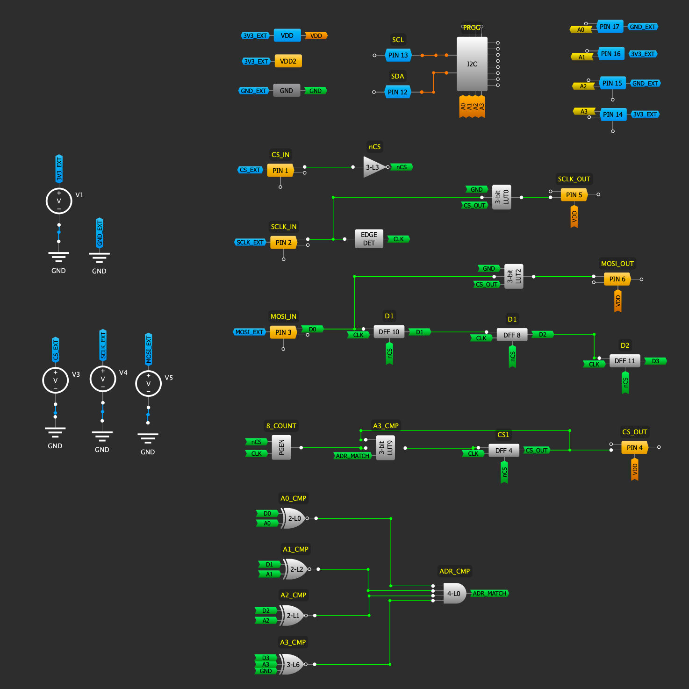

# Addressable SPI Bus

## Status

As of Dec 5th 2023, This design was not tested yet in a real circuit.

## Description
This example demostrates how to add addressing capabilities to a SPI bus such that a single set of CS/CLK/MOSI/MISO lines can be used to address multiple SPI devices, each having its own unique address on the base.

The addressing is done by prepending to each SPI transaction a byte whose 4 least significant bits represent the target device address in the range 0-15 for up to 16 SPI devices. 

Each SPI device uses a SLG46826 SPLD which decodes the address in the first byte and passes the CS/CLK/MOSI signals to the SPI device only if they match the hard wired value of it's 4 address input pins. 

## Notes

* The SPLD does not process the MISO lines which should be connected directly to the SPI devices.
* The current SPLD design support SPI Mode 0. Other modes can be supported in the same way.
* The 4 address inputs are the same that are used by the SLG46826 I2C programming interface which allows to also programming the SLG46826s in-circuit using a single I2C bus.

## Pinout

| Pin | Name         | Direction     | Description |
|---|-----------|-----------|------------|
| 1 |CS_IN | in      | SPI CS signal from the MCU.        |
| 2 |SCK_IN | in      | SPI click signal from the MCU.        |
| 3 |MOSI_IN | in      | SPI MOSI signal from the MCU.        |
| 4 |CS_OUT | out     | CS signal to the SPI device.        |
| 5 |SCK_OUT | out     | Clock signal to the device.        |
| 6 |MOSI_OUT | out      | MOSI signal to the device.        |
| 7 |VDD2 | power in     | 3.3V supply.        |
| 8 | |       | Unused. Leave unconnected.        |
| 9 | |       | Unused. Leave unconnected.        |
| 10 |GND | power in      | 0V supply.        |
| 11 | |       | Unused. Leave unconnected.        |
| 12 |SDA | in/out      | I2C SDA signal for programming. Pullup to 3.3V using a resistor.        |
| 13 |SCL | in      | I2C SCL signal for programming. Pullup to 3.3V using a resistor.       |
| 14 |A3 | in     | Address 0. Tie to 0 or 3.3V.       |
| 15 |A2 | in      | Address 0. Tie to 0 or 3.3V.         |
| 16 |A1 | in      | Address 0. Tie to 0 or 3.3V.        |
| 17 |A0 | in      | Address 0. Tie to 0 or 3.3V.         |
| 18 | |       | Unused. Leave unconnected.        |
| 19 | |       | Unused. Leave unconnected.        |
| 20 |VDD | power in     | 3.3V supply.        |

## Timing Diagrams

## Schematic

## History
* Dec 5th 2023 - Initial version of the document. 