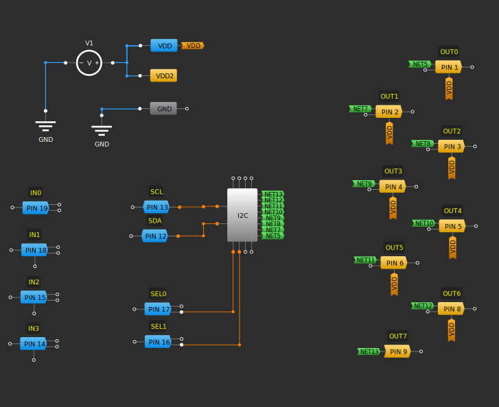

# I2C IO Extender

## Status

Tested successfully with the Python ``greenpak`` package.


## Description

These design uses the SLG46826G SPLD GreenPAK SPLD to create a parallel port that is controlled via I2C. The IO extender contains 8 output pins and 4 input pins but can be easily modified to have different combinations of input and output. Also included is a Python driver that allows to  attach the extender to Windows/Mac/Linux machines using the Python  ```greenpak``` package and a USB to I2C adapter.


## Pinout


| Pins        | Function       | Description                                                                                                                                                                             |
| ----------- | -------------- | --------------------------------------------------------------------------------------------------------------------------------------------------------------------------------------- |
| OUT0 - OUT7 | Output pins    | 8 output pins that can be  controlled via I2C.                                                                                                                                          |
| IN0 - IN3   | Input pins     | 4 input pins that can be read via I2C. The input are pulled up internally with 100k resistors.                                                                                          |
| SCL, SDA    | I2C bus        | The clock and data signals of the I2C bus. These pins are open drain and are not pulled up internally.                                                                                  |
| SEL0, SEL1  | Address select | These two inputs select the I2C address of the IO extender and allow up to 4 IO extenders to be connected to the same I2C bus. These input are pulled up internally with 10K resistors. |
| GND         | Ground         | Signal and power ground.
| VDD, VDD2   | Power          | Typically 3.3V or 5V.                                                                                                                                                                   |

## Python support

| File               | Description                                                    |
| ------------------ | -------------------------------------------------------------- |
| ``flasher.py``     | A script to flash a SLG46826G with the design.                 |
| ``io_extender.py`` | A driver to write/read the IO extender from Windows/Mac/Linux. |
| ``test.py``        | An example of using the IO extender.                           |

## Design




## History

- Jan 11 2024 - Initial version of the document.
